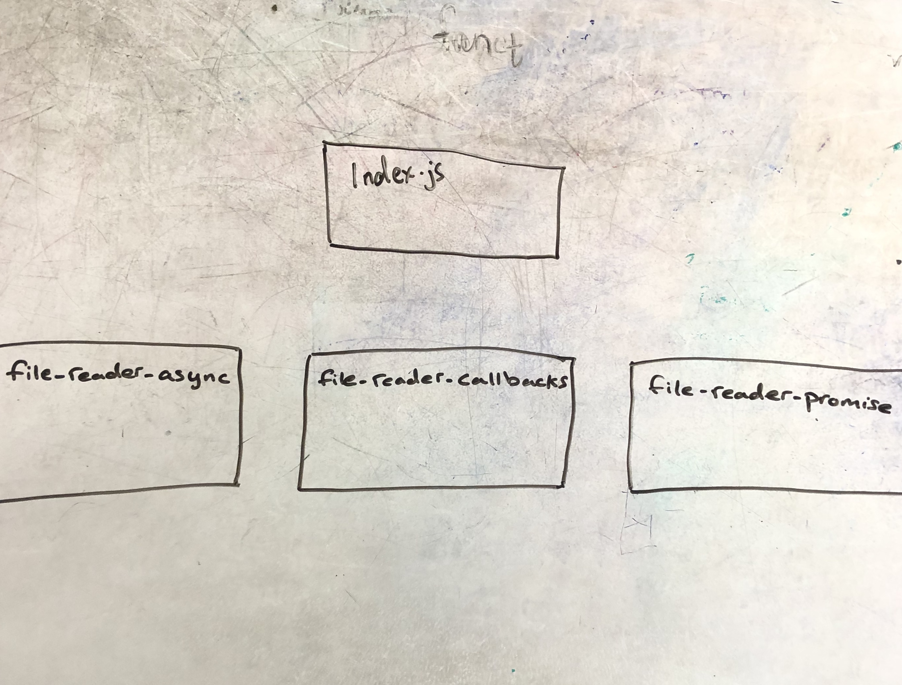

# async-await

# LAB - 03

## Callbacks and Promises

### Author: Alistair Blake

### Links and Resources
* github: (https://github.com/Alwynblake/async-await)

###### `readFile() -> object`
Reads the JSON file, converts it to a string, then parses into an object. 

###### `writeFile() -> string`
Writes a string or buffer into a JSON file.

###### `readFilePromises() -> buffer`
Reads the JSON file, returns a buffer.

###### `writeFilePromises() -> 
Writes a buffer into a JSON file.

### Description of Process:
#### Callback
* When node runs index.js, it imports the class FileEdit and sets it to currentEdit.
* currentEdit will then run the method readFile, which will run fs.readFile. This then provides the contents of the JSON file to the callback, after converting it to a string and parsing it. 
* While still in the callback, the contents are changed using faker to provide new first and last names, and made into a buffer. 
* In the same callback, another method, writeFile, is called. This takes the new changed contents and writes it back into the JSON file by running fs.writeFile. fs.writeFile also provides the data to its callback.
* In the writeFile method's callback, readFile is called again, it runs fs.readFile, provides the changed data from the same JSON file, and in its callback it console.logs this data.

#### Promises
* currentEdit runs the method readFilePromises, which takes in the file name, runs fsExtra.readFile and returns the contents of the JSON file.
* The contents are then converted to a string and parsed into an object, which is returned.
* This object then has the first and last name changed, and made it to a buffer. Another promise is called, writeFilePromises, which runs fsExtra.writeFile to write the buffer into the same initial JSON file.
* currentEdit runs the method readFilePromises again, and the returned data is console logged to show the changed data.

### Setup

#### Running the app
* Use: `node index.js data/person.json`

  * Returns in the console the changed object to be written in the person.json file, as well as the data read again from person.json, as accomplished by callbacks only.

  * Returns in the console the changed object to be written in the person.json file, as well as the data read again from person.json, as accomplished using promises.

  
#### Tests
* Use: 'npm test'

## uml

